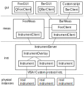

Architecture
============

As introduced in :doc:`overview`, mahos system consists of nodes which are categorized into three layers as visualized below.

.. toctree::
   :maxdepth: 1

   arch_node
   arch_inst
   arch_meas
   arch_gui

   Overview of nodes in the layers

Package layout
--------------

The mahos sub-packages are structured correspondingly, as below.

* :ref:`mahos.node` - Base node implementations.
* :ref:`mahos.msgs` - Message type definitions.
* :ref:`mahos.inst` - Low-level drivers for instruments. :class:`InstrumentServer <mahos.inst.server.InstrumentServer>` node provides RPC with unified API.
* :ref:`mahos.meas` - High-level measurement logics. (explicit state management and file I/O, etc.).
* :ref:`mahos.gui` - GUI frontends.
* :ref:`mahos.cli <mahos.cli>` - Command Line Interfaces.
