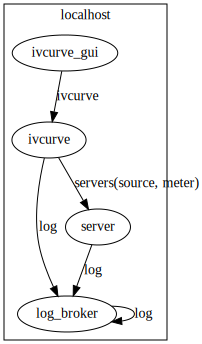

Configuration file
==================

To use mahos system, you have to prepare a toml configuration file.
One good way to get used to this concept may be going through the :doc:`tutorial`.

Here, we put the configuration file for :doc:`tutorial_ivcurve`.

.. code-block:: toml
   :linenos:
   :caption: conf.toml

   [global]
   req_timeout_ms = 60000
   poll_timeout_ms = 100

   [localhost.log_broker]
   module = "mahos.node.log_broker"
   class = "LogBroker"
   target = { log = "localhost::log_broker" }
   xpub_endpoint = "tcp://127.0.0.1:5555"
   xsub_endpoint = "tcp://127.0.0.1:5556"

   [localhost.server]
   module = "mahos.inst.server"
   class = "InstrumentServer"
   target = { log = "localhost::log_broker" }
   log_level = "DEBUG"
   rep_endpoint = "tcp://127.0.0.1:5559"
   pub_endpoint = "tcp://127.0.0.1:5560"

   [localhost.server.instrument.source]
   module = "instruments"
   class = "VoltageSource_mock"
   [localhost.server.instrument.source.conf]
   resource = "VISA::DUMMY0"

   [localhost.server.instrument.meter]
   module = "instruments"
   class = "Multimeter_mock"
   [localhost.server.instrument.meter.conf]
   resource = "VISA::DUMMY1"

   [localhost.ivcurve]
   module = "ivcurve"
   class = "IVCurve"
   rep_endpoint = "tcp://127.0.0.1:5561"
   pub_endpoint = "tcp://127.0.0.1:5562"
   [localhost.ivcurve.target]
   log = "localhost::log_broker"
   [localhost.ivcurve.target.servers]
   source = "localhost::server"
   meter = "localhost::server"

   [localhost.ivcurve_gui]
   module = "ivcurve_gui"
   class = "IVCurveGUI"
   [localhost.ivcurve_gui.target]
   ivcurve = "localhost::ivcurve"

This configuration file is visualized as graph below.

   Node graph for IVCurve

TODO: explain detailed spec. of the configuration file.
