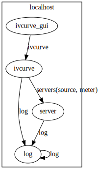

Configuration file
==================

To use mahos system, you have to prepare a toml configuration file.
One good way to get used to this concept may be going through the :doc:`tutorial`.

Here, we put the configuration file for :doc:`tutorial_ivcurve` as a reference.

.. code-block:: toml
   :linenos:
   :caption: conf.toml

   [global]
   req_timeout_ms = 60000
   poll_timeout_ms = 100

   [localhost.log]
   module = "mahos.node.log_broker"
   class = "LogBroker"
   target = { log = "localhost::log" }
   xpub_endpoint = "tcp://127.0.0.1:5555"
   xsub_endpoint = "tcp://127.0.0.1:5556"

   [localhost.server]
   module = "mahos.inst.server"
   class = "InstrumentServer"
   target = { log = "localhost::log" }
   log_level = "DEBUG"
   rep_endpoint = "tcp://127.0.0.1:5559"
   pub_endpoint = "tcp://127.0.0.1:5560"

   [localhost.server.instrument.source]
   module = "instruments"
   class = "VoltageSource_mock"
   [localhost.server.instrument.source.conf]
   resource = "VISA::DUMMY0"

   [localhost.server.instrument.meter]
   module = "instruments"
   class = "Multimeter_mock"
   [localhost.server.instrument.meter.conf]
   resource = "VISA::DUMMY1"

   [localhost.ivcurve]
   module = "ivcurve"
   class = "IVCurve"
   rep_endpoint = "tcp://127.0.0.1:5561"
   pub_endpoint = "tcp://127.0.0.1:5562"
   [localhost.ivcurve.target]
   log = "localhost::log"
   [localhost.ivcurve.target.servers]
   source = "localhost::server"
   meter = "localhost::server"

   [localhost.ivcurve_gui]
   module = "ivcurve_gui"
   class = "IVCurveGUI"
   [localhost.ivcurve_gui.target]
   ivcurve = "localhost::ivcurve"

This configuration file is visualized as graph below.

   Node graph for IVCurve

Node name
---------

The configuration of whole system (global conf) is structured as a dictionary with nested string keys.
TOML can effectively express such data structure.
The top-level key specifies the hostname, except following two special names:

- ``global`` block is used to define global configurations (default configurations for all the nodes).
- ``thread`` block is used to define threaded nodes.

These two names should be considered reserved, and not be used as hostnames.

The second-level key is the nodename.
The fully qualified name of a node consists of the hostname and nodename,
and expressed as ``<hostname>::<nodename>`` (e.g. ``localhost::server``).
The configuration of each node (local config) is written as a dictionary under the nodename
(under the block ``[<hostname>::<nodename>]``),
and this dictionary is binded as ``conf`` attribute of the :class:`Node class <mahos.node.node.Node>`.

Fundamental keys
----------------

Several keys define fundamental properties of node's function and they are used for virtually all the nodes:

- ``module``: The module name holding the Node class. It must be an importable Python module.
- ``class``: The Node class name. The class must be an attribute of the ``module``.
- ``poll_timeout_ms``: timeout for polling of inbound request (:meth:`poll <mahos.node.node.Node.poll>`). It roughly defines rate of main loop (without any requests).
- ``req_timeout_ms``: timeout for REQ-REP communication. It is referenced if the Node sends requests through :class:`NodeClients <mahos.node.client.NodeClient>`.
- ``rep_endpoint``: endpoint for REQ-REP communication. It is necessary if the Node accepts requests.
- ``pub_endpoint``: endpoint for PUB-SUB communication. It is necessary if the Node publishes data.

Target
------

The ``target`` is an important configuration defining (client-server) relations to other nodes.
This is also a dictionary with string keys, and values can take following three types.

- ``str`` (full name of the node) if the target is only one node (as ``log = "localhost::log"`` in example above).
- ``list[str]`` (list of full names) if the target can be multiple nodes.
- ``dict[str, str]`` (instrument name to full name of :class:`InstrumentServer <mahos.inst.server.InstrumentServer>`) this is special case for measurement nodes using InstrumentServers and simultaneously defines the instruments to be used (see line 39-41 in example above).

InstrumentServer
----------------

The :class:`InstrumentServer <mahos.inst.server.InstrumentServer>` holds :class:`Instruments <mahos.inst.instrument.Instrument>` and :class:`InstrumentOverlays <mahos.inst.overlay.overlay.InstrumentOverlay>`.

An Instrument config is defined under ``[<hostname>.<nodename>.instrument.<instname>]`` (as in ``[localhost.server.instrument.source]`` in line 20), where following three keys are given.

- ``module``: The module name holding the Instrument class. It must be an importable Python module, but leading ``mahos.inst.`` can be omitted if a submodule in ``mahos.inst`` package is used.
- ``class``: The Instrument class name. The class must be an attribute of the ``module``.
- ``conf``: The configuration dictionary for the Instrument (this is optional, but usually necessary).

An InstrumentOverlay config is defined under ``[<hostname>.<nodename>.instrument_overlay.<instname>]``, where following three keys are given.

- ``module``: The module name holding the InstrumentOverlay class. It must be an importable Python module, but leading ``mahos.inst.overlay.`` can be omitted if a submodule in ``mahos.inst.overlay`` package is used.
- ``class``: The InstrumentOverlay class name. The class must be an attribute of the ``module``.
- ``conf``: The configuration dictionary for the InstrumentOverlay. If a value in this dictionary is a string starting with ``$``, it is considered a reference to Instrument / InstrumentOverlay in the same server. The overlay receives resolved value, i.e., an Instrument / InstrumentOverlay instance instead of a string.

.. _conf threading:

Threading
---------

By default, each node run as a process, and TCP is used for inter-process communication.
When you need to reduce overhead of TCP communication, 
the nodes can be run as individual threads inside single process.
To enable this feature, you need to make slight modifications in the configuration file.
Here, we put an example of modified configuration file for :doc:`tutorial_ivcurve`.

.. code-block:: toml
   :linenos:
   :caption: conf_thread_partial.toml

   [global]
   req_timeout_ms = 60000
   poll_timeout_ms = 100

   [thread.localhost]
   server_ivcurve = ["server", "ivcurve"]

   [localhost.log]
   module = "mahos.node.log_broker"
   class = "LogBroker"
   target = { log = "localhost::log" }
   xpub_endpoint = "tcp://127.0.0.1:5555"
   xsub_endpoint = "tcp://127.0.0.1:5556"

   [localhost.server]
   module = "mahos.inst.server"
   class = "InstrumentServer"
   target = { log = "localhost::log" }
   log_level = "DEBUG"
   rep_endpoint = "inproc://server_rep"
   pub_endpoint = "inproc://server_pub"

   [localhost.server.instrument.source]
   module = "instruments"
   class = "VoltageSource_mock"
   [localhost.server.instrument.source.conf]
   resource = "VISA::DUMMY0"

   [localhost.server.instrument.meter]
   module = "instruments"
   class = "Multimeter_mock"
   [localhost.server.instrument.meter.conf]
   resource = "VISA::DUMMY1"

   [localhost.ivcurve]
   module = "ivcurve"
   class = "IVCurve"
   rep_endpoint = "tcp://127.0.0.1:5561"
   pub_endpoint = "tcp://127.0.0.1:5562"
   [localhost.ivcurve.target]
   log = "localhost::log"
   [localhost.ivcurve.target.servers]
   source = "localhost::server"
   meter = "localhost::server"

   [localhost.ivcurve_gui]
   module = "ivcurve_gui"
   class = "IVCurveGUI"
   [localhost.ivcurve_gui.target]
   ivcurve = "localhost::ivcurve"

This configuration aims to run the ``server`` and ``ivcurve`` nodes as the threads in a process.
The threaded nodes are defined as ``dict[str, list[str]`` under the ``[thread.<hostname>]`` block.
In the example, ``[thread.localhost]`` block is added at line 5.
Line 6 defines a set of threaded nodes named ``server_ivcurve`` which consists of ``server`` and ``ivcurve`` nodes.
The ``mahos graph`` command can visualize the threaded nodes like below.

.. figure:: ./img/ivcurve-nodes-threaded.svg
   :alt: Node graph for IVCurve with threaded nodes
   :width: 40%

   Node graph for IVCurve with threaded nodes

The endpoint must be changed to take advantage of threaded nodes.
The line 20-21 defines endpoints with inprocess protocols (``inproc://``).
This protocol is implemented (by ZeroMQ) with shared memory, 
and thus it can boost the transfer rate of the large data.

To run a set of threaded nodes, execute command like ``mahos run -t server_ivcurve`` 
(``-t`` is necessary to tell that you want to run threaded nodes instead of normal node).
The ``mahos launch`` command automatically detects threaded nodes and start all of them 
with matching hostname.
